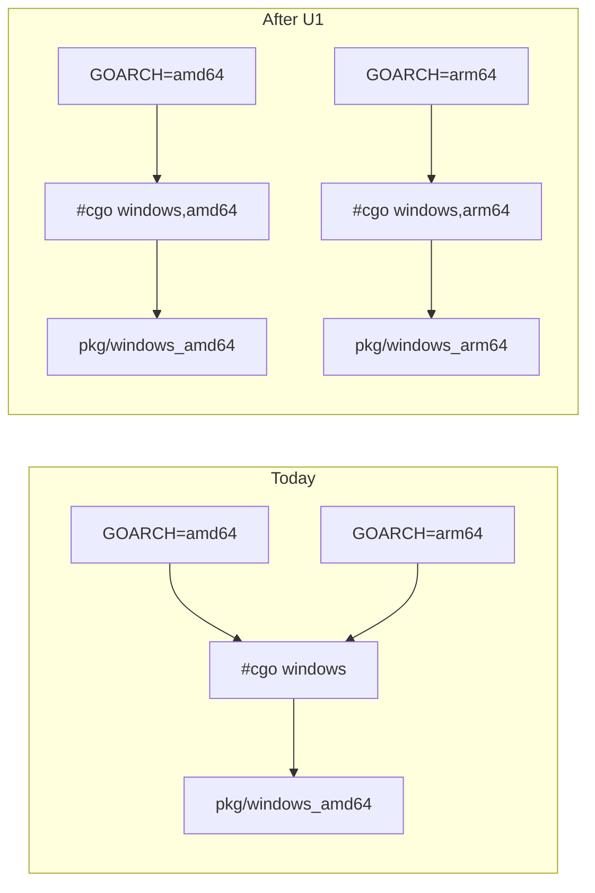
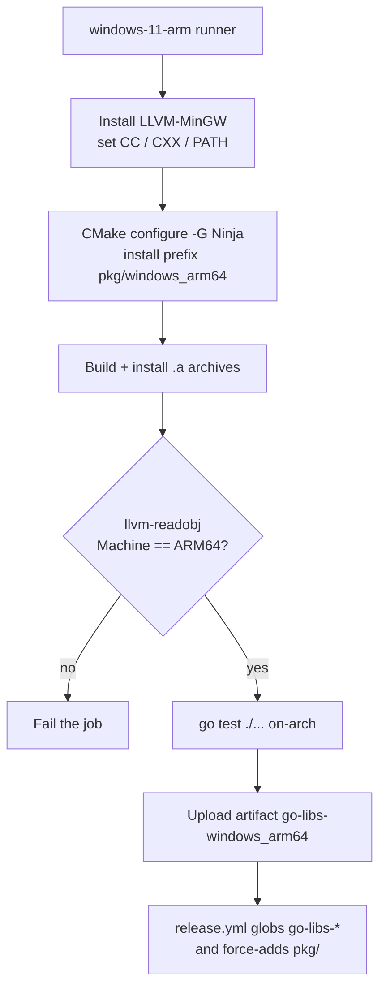

# Go Wrapper windows_arm64 CI Target - Plan

## Goal Capsule

**Objective.** Add a sixth build target, `windows_arm64`, to the Go wrapper's CI matrix so the Go module ships prebuilt static libraries for Windows on ARM64 alongside the existing five targets.

**Authority hierarchy.** Requirements (R-IDs) win on what must be true. Key Technical Decisions (KTD-IDs) win on mechanism. Unit Approach fields carry unit-local sequencing only.

**Stop conditions.** Stop and surface a blocker if: the `windows-11-arm` runner cannot produce an `aarch64-w64-mingw32` GNU-ABI toolchain at all; or the post-quantum libraries cannot build for aarch64/COFF even with their assembly backends disabled. Both would change the shape of the plan, not just its details.

**Execution profile.** Build/config work with no user-facing behavior. Proof is a green CI job plus an on-arch `go test ./...`, not unit-test coverage.

**Tail ownership.** Branch `feat/ci-go-windows-arm64` already exists off `develop`. Per repo instructions, feature PRs target `develop`, never `main`.

---

## Product Contract

### Summary

Add `windows_arm64` to `.github/workflows/build-go.yml` on the native `windows-11-arm` runner with an MSYS2 CLANGARM64 toolchain, teach the Go codegen to emit arch-constrained cgo directives for Windows, and add a PE-format architecture check covering both Windows targets. The release workflow needs no change.

### Problem Frame

The Go wrapper links against static libraries committed under `wrappers/go/pkg/<os>_<arch>/`. Five targets exist; Windows is served only by `windows_amd64`. Consumers on Windows ARM64 have no working build: the generated cgo directive in `wrappers/go/foundation/platform.go` is an unconstrained `#cgo windows`, so a windows/arm64 build silently resolves to the amd64 library path and fails at link time.

A prior incident makes the verification gap concrete. `docs/solutions/build-errors/go-wrapper-linux-arm64-wrong-arch-prebuilt-2026-05-15.md` records that release rc.8 shipped `linux_arm64` archives containing x86-64 objects, undetected because nothing verified the output. That incident is why the matrix carries `expected_elf_arch`. That check uses `readelf`, which cannot read PE/COFF, so both Windows targets are unverified today.

### Requirements

**Build target coverage**

R1. The Go build workflow produces installed static libraries and headers at `wrappers/go/pkg/windows_arm64/` for every event that triggers `build-go.yml`.
R2. The `windows_arm64` job runs `go test ./...` from `wrappers/go` natively on the runner.
R3. The release workflow picks up the new target with no edits to `.github/workflows/release.yml`.

**cgo link resolution**

R4. Generated cgo directives resolve a windows/amd64 build to `pkg/windows_amd64` and a windows/arm64 build to `pkg/windows_arm64`.
R5. `tools/codegen` remains the single source for `platform.go`; a full regeneration produces an empty git diff against the committed files.
R6. The Windows ARM64 build uses a GNU-ABI toolchain so archives stay named `lib<name>.a` and link via `-l<name>`, preserving the existing cgo directive shape.

**Verification**

R7. A post-build architecture check fails the job when a produced archive is not the expected machine type. It covers `windows_arm64` and `windows_amd64`.
R8. The build is validated on real Windows 11 ARM64 hardware before the change is considered proven, and the procedure is written down.
R9. The committed `wrappers/go/pkg/windows_arm64/` archives — not only freshly built ones — are proven to link and pass tests.
R10. The toolchain is provisioned at a pinned version through an action, never an unmediated URL download.

**Consumer-facing surface**

R11. `README.md` and `ChangeLog.md` reflect the new supported target.

### Scope Boundaries

Out of scope: every non-Go wrapper (Java, Python, Swift, PHP, WASM, C++); any change to `.github/workflows/release.yml`; adding Git LFS tracking for `wrappers/go/pkg/**/*.a`.

#### Deferred to Follow-Up Work

- The committed `lib/pkgconfig/mbedcrypto.pc` in every target hardcodes a CI build path (`prefix=D:/a/virgil-crypto-c/...`). `windows_arm64` will inherit the same wart. Fixing it repo-wide is separate work.
- `wrappers/go/build-go/` and `wrappers/go/build-go-install/` are stray in-source CMake artifacts in the working tree, contrary to the repo's CMake rules. Cleaning them is unrelated to this change.
- Mach-O architecture verification for `darwin_amd64` and `darwin_arm64`, which carry no arch check today. `darwin_amd64` is a cross-compile, so it holds the same failure mode as the rc.8 incident.
- Generated `platform.go` references `pkg/linux_amd64__legacy_os`, which does not exist in the tree. Only reachable under `-tags legacy`, and pre-existing.

### Sources

- `docs/solutions/build-errors/go-wrapper-linux-arm64-wrong-arch-prebuilt-2026-05-15.md` — why arch verification is mandatory for a new target, in the same change that adds it.
- `docs/solutions/build-errors/go-cgo-stale-committed-pkg-headers-2026-06-18.md` — cgo compiles against the *committed* `pkg/<target>/include`, not what CI installs locally.
- `docs/solutions/best-practices/codegen-full-regeneration-and-consistency-check-2026-07-05.md` — regenerate-then-empty-diff is the codegen consistency gate.
- `docs/solutions/best-practices/unified-ci-release-workflow-2026-05-09.md` — adding a matrix row is the entire release-side change.
- [actions/runner-images `Install-Mingw64.ps1`](https://github.com/actions/runner-images/blob/main/images/windows/scripts/build/Install-Mingw64.ps1) — the image's `gcc 14.2.0` is niXman mingw-builds, x86_64/i686 only.
- [MSYS2 `mingw-w64-clang-aarch64-toolchain`](https://packages.msys2.org/) via [`msys2/setup-msys2`](https://github.com/msys2/setup-msys2) — the CLANGARM64 GNU-ABI toolchain and its action.
- [Microsoft Image File Machine Constants](https://learn.microsoft.com/en-us/windows/win32/sysinfo/image-file-machine-constants) — `IMAGE_FILE_MACHINE_ARM64 (0xAA64)`, `IMAGE_FILE_MACHINE_AMD64 (0x8664)`.
- `.github/workflows/build-wasm.yml` — `mymindstorm/setup-emsdk@v14` with `version: '4.0.4'`, the in-repo precedent for action-mediated, version-pinned toolchain provisioning. `build-python.yml` pins `cibuildwheel==2.21.3` the same way.
- `.github/workflows/release.yml:73-74` — `release-commit` declares `needs: [build-go, build-apple]`, which is why a failed matrix leg cannot produce a partial release.
- `.github/workflows/build-python.yml` — the `linux-aarch64` cibuildwheel job, evidence the PQ libraries already build for AArch64.

---

## Planning Contract

### Key Technical Decisions

KTD1. Build on the native GitHub-hosted `windows-11-arm` runner. *(session-settled: user-directed — chosen over cross-compiling from `windows-latest`: the native runner lets `go test ./...` execute on-arch, matching how `darwin_arm64` and `windows_amd64` already self-test.)* The repo is public, so the runner is free. The label is still formally in public preview; expect longer queue times than `windows-latest`.

KTD2. Provision the aarch64 toolchain with `msys2/setup-msys2` (`msystem: CLANGARM64`, installing `mingw-w64-clang-aarch64-toolchain`), pinned by action major tag. *(session-settled: user-directed — chosen over a direct pinned+checksummed `mstorsjo/llvm-mingw` release download: the action route keeps provisioning mediated and signature-verified, matching the `mymindstorm/setup-emsdk@v14` precedent in `build-wasm.yml`, at the cost of a pacman sync.)* Do not use the runner's preinstalled `gcc`: the image ships `gcc 14.2.0` from niXman mingw-builds, which has no aarch64 variant and runs under x64 emulation, so it cannot emit aarch64 objects. CLANGARM64 supplies a GNU-ABI `aarch64-w64-mingw32` sysroot, satisfying R6. Governs R10.

KTD3. Use `-G Ninja` for this target rather than the `-G "MinGW Makefiles"` used by `windows_amd64`. That generator pairs with GCC-family `mingw32-make`; the CLANGARM64 toolchain is Clang-based. Install Ninja through the same pacman transaction rather than relying on the runner image — the plan has no verified claim about what `windows-11-arm` preinstalls.

KTD4. Split the Windows expansion in `_PLATFORM_EXPANSIONS` (`tools/codegen/project_go_backend.py`), not in the model XML. `tools/codegen/test_go_backend.py` asserts the source-XML platform list is exactly `["darwin", "linux,!legacy", "linux,legacy", "windows"]`; changing the XML breaks that assertion for no benefit. Governs R4, R5.

KTD5. Verify PE architecture with `llvm-readobj --file-headers`, and apply the same step to `windows_amd64`. *(session-settled: user-approved — chosen over leaving `windows_amd64` unverified: one step serves both Windows targets.)* `windows_amd64` is one of **three** currently unverified targets — `darwin_amd64` and `darwin_arm64` also carry no `expected_elf_arch` key, and `darwin_amd64` is a cross-compile on an arm64 host, structurally the same setup as the rc.8 incident. Mach-O verification for the darwin pair is listed under Deferred, not closed by this plan. Match on the full `IMAGE_FILE_MACHINE_ARM64` / `IMAGE_FILE_MACHINE_AMD64` constant: `llvm-readobj` never prints a bare `ARM64` token, so the ELF step's exact-equality comparison cannot be copied verbatim. Governs R7.

KTD6. Attempt the AArch64 assembly backends for `mlkem-native` and `mldsa-native` first, and fall back to their portable C backends only if assembly fails. The AArch64 assembly is **already proven on this project**: `-DVIRGIL_POST_QUANTUM=ON` applies to every Go target, so `linux_arm64` and `darwin_arm64` build these libraries for AArch64 today, and the ELF check verifies `libmlkem768.a` and `libfalcon.a` on `linux_arm64`. `linux-aarch64` Python wheels ship the same code. The untested delta is therefore narrow — COFF object format instead of ELF/Mach-O, the Windows AAPCS64 variant, and Clang's integrated assembler instead of GNU `as` — not the AArch64 backends themselves. Expect this to work; treat failure as the exception. The fallback extends the `if(MSVC)` guards to cover Windows-on-ARM64, setting `MLK_CONFIG_NO_ASM` / `MLD_CONFIG_NO_ASM`, and its cost is not performance alone: the upstream CMake comment states the flag supplies C fallbacks for the **value barriers** the assembly otherwise provides, and value barriers are a side-channel construct whose C form is best-effort against an optimizing compiler. Taking the fallback accepts reduced side-channel assurance on this target relative to every other ARM64 target, so it requires known-answer validation and an explicit note in the learning file, not a silent switch.

### High-Level Technical Design

**cgo link resolution after the codegen split.** Today one unconstrained directive serves all Windows builds and resolves to the amd64 path. The split introduces the missing arch dimension.

`generate_go_platform` emits one CFLAGS/LDFLAGS pair per expansion entry. The `libraries` string is per-`cgo_link`, not per-expansion, so both Windows arches share one library list — which is what they need. No schema change.

**Job pipeline and where the new gate sits.** The architecture check is the gate that must exist before the artifact can be trusted, because everything downstream of it is automatic.

Step `I` is existing behavior and requires no edit: `release.yml` matches `pattern: go-libs-*`, strips the prefix generically, and runs a blanket `git add --force wrappers/go/pkg/`. This satisfies R3.

A partial release cannot occur. `release-commit` declares `needs: [build-go, build-apple]`, and `fail-fast: false` only prevents sibling matrix legs from being cancelled — it does not make a failed job report success. A failed `windows_arm64` leg fails `build-go`, so `release-commit` is skipped and no tag is pushed.

### Assumptions

- `actions/setup-go` resolves a native windows/arm64 Go distribution on this runner. Upstream Go has published `windows-arm64` archives since 1.17 and the action auto-detects runner architecture, but the action's docs do not name windows/arm64 explicitly. U3 proves this before the full build is wired.
- `msys2/setup-msys2` runs on the `windows-11-arm` image and its `CLANGARM64` environment resolves. This is the toolchain's single point of failure; U3's sanity probe proves it first.

### Risks & Dependencies

| Risk | Impact | Mitigation |
|---|---|---|
| `mlkem-native` / `mldsa-native` AArch64 assembly does not assemble under COFF | Forces the KTD6 fallback, which costs side-channel assurance | Lower than it first appears: the same AArch64 assembly already builds for `linux_arm64` and `darwin_arm64`, so only the object format, Windows ABI variant, and assembler differ. KTD6 fallback is gated on known-answer tests. Isolated to U2. |
| `windows-11-arm` is still labeled public preview; reported arch self-misdetection and transient tooling gaps | Flaky or wrong-arch builds | U3 opens with a sanity probe printing the compiler triple, `ninja --version`, `llvm-readobj --version`, and `go env GOOS GOARCH`. |
| Python is unavailable or not on `PATH` as `python3` | CMake configure fails before any library builds | Root `CMakeLists.txt` runs `python3 -m venv` and `pip3 install` at configure time, so Python is a hard build dependency, not a bumpver convenience. If `setup-python` lacks windows/arm64 support, provision Python another way — alias the runner's interpreter to `python3`/`pip3`, or pre-set `VIRTUAL_ENV` to skip venv creation. Removing the step is not an option. |
| `falcon` builds with `-Werror` under its Clang branch | A new-toolchain warning becomes a build failure | U2's spike records it separately so it is not misread as a PQ-assembly failure. |
| Mixing objects from two toolchain distributions | Link-time ABI errors | Build every library for this target with the same CLANGARM64 toolchain. Never mix with `windows_amd64` output. |
| Consumers linking windows/arm64 with a different toolchain | Unresolved compiler-rt builtins at the consumer's cgo link step | Record the LLVM/CLANGARM64 link requirement in U6's docs and the U5 learning file, so it is a stated contract rather than implicit. |

---

## Implementation Units

### U1. Split the Windows cgo platform expansion in codegen

**Goal:** Generated cgo directives distinguish windows/amd64 from windows/arm64.

**Requirements:** R4, R5. Implements KTD4.

**Dependencies:** none.

**Files:**
- `tools/codegen/project_go_backend.py` (modify — `_PLATFORM_EXPANSIONS`)
- `wrappers/go/foundation/platform.go` (regenerated)
- `wrappers/go/phe/platform.go` (regenerated)
- `wrappers/go/ratchet/platform.go` (regenerated)
- `tools/codegen/test_go_backend.py` (modify — add the missing ratchet case)

**Approach:**
1. Replace the `"windows"` entry's single `("windows", None)` expansion with `("windows,amd64", "windows_amd64")` and `("windows,arm64", "windows_arm64")`.
2. Leave the model XML untouched — per KTD4, the `cgo_link` entries in `codegen/models/project_{foundation,phe,ratchet}/` stay as they are.
3. Regenerate with `python3 -m tools.codegen.common_bootstrap --project all --apply` and commit the three resulting `platform.go` files in the same commit.
4. Add a ratchet byte-identity test mirroring the existing foundation and phe cases in `PlatformGoTests`. Ratchet is the only project with no such test, and this change touches it.

Preserve the per-project library lists verbatim. Ratchet's Windows line omits `-lbcrypt` where foundation and phe include it; that asymmetry is existing behavior and is not this unit's concern.

**Patterns to follow:** the `darwin` and `linux,legacy` entries already use table-level `path_override` for multi-arch expansion — mirror that shape.

**Test scenarios:**
- `generate_go_platform` for foundation emits exactly two Windows directive pairs, one constrained `windows,amd64` pointing at `pkg/windows_amd64`, one constrained `windows,arm64` pointing at `pkg/windows_arm64`.
- The generated foundation output is byte-identical to the committed `wrappers/go/foundation/platform.go` (existing test, must stay green after regeneration).
- The same byte-identity holds for phe and for the newly added ratchet case.
- The XML round-trip assertion still sees exactly four platform specs — proves the model XML was not touched.
- No non-Windows directive changed: darwin and linux directive pairs are unchanged from the committed files.

**Verification:** `python3 -m pytest tools/codegen/ -q` passes, and a second full regeneration leaves `git diff` empty.

---

### U2. Establish an aarch64-w64-mingw32 build of the C libraries

**Goal:** The C libraries and their vendored dependencies compile and archive for `aarch64-w64-mingw32`.

**Requirements:** R6. Implements KTD2, KTD3, KTD6.

**Dependencies:** none (parallel to U1).

**Files:**
- `thirdparty/mlkem-native/mlkem.CMakeLists.txt` (modify only if the assembly backend fails)
- `thirdparty/mldsa-native/mldsa.CMakeLists.txt` (modify only if the assembly backend fails)

**Approach:**
1. Install the CLANGARM64 toolchain and Ninja, then configure with `-G Ninja` and the same `configs/go-config.cmake` preset the other Go targets use.
2. Pass no ed25519 flags. `thirdparty/ed25519/features.cmake` already defaults to `ED25519_REF10=ON` with the AMD64 radix path off, and the `ASM` language is only enabled when a radix option is on. Only `linux_amd64` opts into the assembly path.
3. Confirm network access from the build environment — mbedTLS, mlkem-native, and mldsa-native are all `ExternalProject_Add` with git/tarball fetches.
4. Build and record which components fail, distinguishing PQ-assembly failures from `falcon`'s `-Werror` warnings-as-errors under Clang. mbedTLS needs no AES-NI handling: `thirdparty/mbedtls/config.h.in` defines neither `MBEDTLS_AESNI_C` nor `MBEDTLS_AESCE_C`. Diff any PQ assembly failure against the working `linux_arm64` build — the same sources compile there, so a failure is an object-format, ABI, or assembler difference, and the error should say which.
5. If `mlkem-native` or `mldsa-native` assembly fails, extend their `if(MSVC)` guards to also cover Windows on ARM64 so the C-only sources and `MLK_CONFIG_NO_ASM` / `MLD_CONFIG_NO_ASM` apply. Verify `CMAKE_SYSTEM_PROCESSOR` is forwarded correctly — both are `ExternalProject_Add` and rely on `cmake/TransitiveToolchainArgs.cmake`.

**Execution note:** This is a spike before it is a change. Prove the build first — on the Windows 11 ARM VM is fine — and only then commit whatever CMake guard edits it turned out to need. Do not pre-emptively disable the assembly backends.

**Patterns to follow:** the existing `if(MSVC)` branches in both PQ CMake files already select the C-only backend; extend the condition rather than adding a parallel branch.

**Test scenarios:**
- All 13 expected archives are produced under the install prefix's `lib/`, named `lib<name>.a`.
- `libmlkem768.a` and `libmldsa65.a` build, whether via the assembly or the C backend.
- Linking a trivial cgo program against `libvsc_foundation.a` resolves `-lbcrypt` from the CLANGARM64 sysroot.
- Toolchain identity check: the selected compiler's `-dumpmachine` reports an aarch64 target, confirming the emulated x86_64 `gcc` was not picked up.
- `falcon` compiles clean under Clang's `-Werror` branch, or the specific warnings are recorded.
- If the fallback fires: ML-KEM-768 and ML-DSA-65 known-answer vectors on the aarch64 build match the bytes produced by the `linux_amd64` assembly-backend build, using the seeds already in `tests/foundation/test_post_quantum_library_ml_kem.c`. Build success alone does not clear KTD6.
- If the fallback fires: an x86_64 Windows build still selects the assembly backend, proving the widened guard did not regress `windows_amd64`.

**Verification:** a complete install tree exists at the chosen prefix, every produced archive reports ARM64 under `llvm-readobj --file-headers`, and — where the KTD6 fallback fired — the PQ known-answer comparison passes.

---

### U3. Add the windows_arm64 job to the Go build matrix

**Goal:** CI builds and tests the target on every triggering event.

**Requirements:** R1, R2, R3, R10. Implements KTD1, KTD2, KTD3.

**Dependencies:** U1, U2.

**Files:**
- `.github/workflows/build-go.yml` (modify)

**Approach:**
1. Add a matrix entry `target: windows_arm64`, `runner: windows-11-arm`, `run_tests: true`, and `cmake_extra: -G Ninja`.
2. Add a `msys2/setup-msys2` step gated to this target, with `msystem: CLANGARM64` and the toolchain plus Ninja in `install:`.
3. Make the toolchain reach later steps. Steps do not inherit each other's shell environment, so an install step that only exports `CC`/`CXX`/`PATH` into its own shell leaves the build step falling back to the emulated x86_64 `gcc` — the exact silent wrong-arch outcome KTD2 guards against. Either give the shared build and test steps a per-target shell (`shell: ${{ matrix.shell || 'bash' }}` with `msys2 {0}` on this entry), or set `path-type: inherit` and write `CC`/`CXX` to `$GITHUB_ENV` and the toolchain bin to `$GITHUB_PATH`. Pick one and apply it consistently to both the build step and `Run Go tests`.
4. Open the job with a sanity probe printing the compiler `-dumpmachine`, `ninja --version`, `llvm-readobj --version`, `cmake --version`, and `go env GOOS GOARCH`, so a runner-image regression is legible in the log rather than surfacing as a confusing build failure.
5. Reuse the existing `nproc`-with-fallback parallelism expression; it already degrades to `echo 4` on Windows.
6. Ensure `python3` and `pip3` resolve on this runner. They are a hard configure-time dependency of the root `CMakeLists.txt`, not a bumpver convenience — see the Risks table. Do not gate the Python provisioning off.

Leave `.github/workflows/release.yml` untouched. It globs `go-libs-*`, so R3 is satisfied by the artifact name the existing upload step already derives from `matrix.target`.

**Patterns to follow:** `build-wasm.yml`'s `mymindstorm/setup-emsdk` step for action-mediated, version-pinned toolchain provisioning; the `windows_amd64` entry for Windows-specific step gating; the `linux_arm64` entry for how a target-specific toolchain install is expressed.

**Test scenarios:**
- A push to the branch runs a job named `Go (windows_arm64)` and it completes green.
- The job uploads an artifact named `go-libs-windows_arm64` containing `lib/` and `include/`.
- `go test ./...` runs from `wrappers/go` on the runner and passes, exercising foundation, phe, and ratchet against the newly built archives.
- The five pre-existing matrix jobs are unchanged and still green.
- The sanity probe reports an aarch64 compiler triple and `GOARCH=arm64`, and both `ninja` and `llvm-readobj` resolve.
- Environment propagation: the compiler the *build* step actually invokes reports an aarch64 triple, proving the toolchain crossed the step boundary rather than only existing in the install step's shell.
- Failure path: with the toolchain step removed, the job fails rather than silently producing x86_64 archives — confirms `CGO_ENABLED` did not fall back to 0 against the emulated `gcc`.

**Verification:** all six matrix jobs green on the branch, with the `windows_arm64` artifact present in the run summary.

---

### U4. Verify PE architecture for both Windows targets

**Goal:** CI fails when a Windows target produces archives of the wrong machine type.

**Requirements:** R7. Implements KTD5.

**Dependencies:** U3.

**Files:**
- `.github/workflows/build-go.yml` (modify)

**Approach:**
1. Add a matrix key carrying the expected PE machine as the **full constant** — `IMAGE_FILE_MACHINE_ARM64` for `windows_arm64`, `IMAGE_FILE_MACHINE_AMD64` for `windows_amd64` — parallel to the existing `expected_elf_arch` key. `llvm-readobj` prints `Machine: IMAGE_FILE_MACHINE_ARM64 (0xAA64)` and never a bare `ARM64`, so copying the ELF step's exact-equality comparison against a short token would fail every archive including correct ones.
2. Add a step gated on that key that runs `llvm-readobj --file-headers` over the same five libraries the ELF check covers — `libvsc_foundation.a`, `libvsc_ratchet.a`, `libmlkem768.a`, `libfalcon.a`, `libmbedcrypto.a` — matching every `Machine:` line against the expected constant and failing on any mismatch.
3. Report every mismatched library before exiting, mirroring the ELF step's loop-then-fail shape rather than failing on the first one.
4. Begin the step with an availability probe for `llvm-readobj`. On `windows_arm64` it arrives with the CLANGARM64 toolchain, but the `windows_amd64` retrofit depends on the `windows-latest` image providing it. Without the probe an image change turns a previously-green target red with a misleading arch-verification failure instead of a legible tooling message.
5. Place the step after install and before the artifact upload, so a wrong-arch archive can never reach the release commit.

`readelf` is not an option here; it is ELF-only.

**Patterns to follow:** the existing `Verify binary architecture` step — same library list, same `failed=1` accumulate-then-exit structure, same `if:` gating on a matrix key being non-empty.

**Test scenarios:**
- `windows_arm64` passes the check against correctly built ARM64 archives.
- `windows_amd64` passes the check against its existing x86-64 archives — proves the retrofit does not break a target that was previously unchecked.
- Negative case: pointing the check at an archive of the other architecture fails the job with a message naming the offending library and both the actual and expected machine values.
- The step is skipped, not failed, on the four non-Windows targets, which carry no expected-PE-machine key.
- The ELF check still runs unchanged for `linux_amd64` and `linux_arm64`.

**Verification:** both Windows jobs log an explicit per-library OK line, and a deliberately mismatched archive fails the job locally or in a scratch run.

---

### U5. Validate on Windows 11 ARM64 hardware and capture the learning

**Goal:** The target is proven on real hardware, and the next person does not re-derive the runner and toolchain gotchas.

**Requirements:** R8, R9.

**Dependencies:** U2, U3, U4.

**Files:**
- `docs/solutions/best-practices/go-wrapper-windows-arm64-target-2026-08-08.md` (create)

**Approach:**
1. On the Parallels Windows 11 ARM64 VM, install the same CLANGARM64 toolchain CI uses, configure and build with the same flags, and run `go test ./...` from `wrappers/go` against the locally built archives.
2. Then prove R9 against what consumers actually receive: check out the branch carrying the committed `wrappers/go/pkg/windows_arm64/`, and run `go build ./...` and `go test ./...` with **no local rebuild**. Every other gate in this plan tests freshly built archives; this is the only step that exercises the committed ones, which is the artifact a module consumer links.
3. Compare all three results — CI, local build, committed archives. A divergence between any two is itself the finding worth recording.
4. Write the learning with the repo's YAML frontmatter convention (`module`, `tags`, `problem_type`). Cover the five things no existing entry documents: the preinstalled `gcc` on `windows-11-arm` is x86_64-only and unusable; MSYS2 CLANGARM64 is the toolchain that preserves the `.a` / `-l` conventions; PE architecture verification needs `llvm-readobj` with the full `IMAGE_FILE_MACHINE_*` constant, not `readelf`; whatever the PQ assembly backends actually did under COFF, including the side-channel note if the fallback fired; and the consumer-side requirement that a windows/arm64 cgo consumer link with a compatible LLVM/CLANGARM64 toolchain, with the observed symbol errors if a different one is tried.

**Execution note:** This is documentation of what happened, written after the build is green. Do not write it speculatively from the plan — record the observed outcome, including any step of this plan that turned out to be wrong.

**Test scenarios:** `Test expectation: none -- validation and documentation unit; the proof is the VM runs recorded in the learning, and the doc itself carries no behavior.`

**Verification:** `go test ./...` passes on the VM against both freshly built and committed archives, and the learning file exists with valid frontmatter matching the shape of existing `docs/solutions/best-practices/` entries.

---

### U6. Announce the target on the consumer-facing surface

**Goal:** A downstream Go developer can discover that windows/arm64 is supported.

**Requirements:** R11.

**Dependencies:** U3.

**Files:**
- `README.md` (modify)
- `ChangeLog.md` (modify)

**Approach:**
1. Update the `build-go` row of the release-stage table in `README.md`, which currently reads "Cross-compiles static libs for 5 platforms (linux amd64/arm64, darwin amd64/arm64, windows amd64)". It is the only place in the repo that enumerates Go prebuilt targets, so it becomes factually wrong the moment U3 lands.
2. Add a `### New` entry to `ChangeLog.md` under the next version announcing Go prebuilt support for windows/arm64, matching how prior user-visible capabilities were announced.
3. Note the consumer-side toolchain requirement from U5 alongside the README change, so the link constraint is stated rather than implicit.

**Patterns to follow:** existing `### New` entries in `ChangeLog.md` for wording and placement.

**Test scenarios:** `Test expectation: none -- documentation-only unit with no behavior. Correctness is that the platform count and list match the shipped matrix.`

**Verification:** the README table names six platforms including windows arm64, and the ChangeLog carries the entry. Per repo convention this commit is docs-only and ends with `[skip ci]`.

---

## Verification Contract

| Gate | Command / check | Applies to |
|---|---|---|
| Codegen tests | `python3 -m pytest tools/codegen/ -q` | U1 |
| Codegen consistency | `python3 -m tools.codegen.common_bootstrap --project all --apply` then `git diff --exit-code` | U1 |
| C build | `cmake -DCMAKE_BUILD_TYPE=Release -Bbuild -S.` then `cmake --build build -j$(nproc)` | pre-push, all units |
| C tests | `cd build && ctest --output-on-failure` | pre-push, all units |
| Go build and tests | `go build ./...` and `go test ./...` from `wrappers/go` | U1, U3, U5 |
| CI matrix | All six `build-go.yml` jobs green, including `Go (windows_arm64)` | U3, U4 |
| Arch verification | Both Windows jobs log per-library OK lines from the PE check | U4 |
| On-hardware proof | `go test ./...` passes on the Windows 11 ARM64 VM, against freshly built **and** committed archives | U5 |
| PQ equivalence (only if the KTD6 fallback fires) | ML-KEM-768 / ML-DSA-65 known-answer bytes match the `linux_amd64` assembly build | U2 |
| Docs accuracy | README platform list and count match the shipped matrix | U6 |

Per the repo's standing rule, the C build and `ctest` run before any push. Go wrapper changes additionally require `go build ./...` and `go test ./...` from `wrappers/go`; the duplicate-library linker warning from `ld` is benign.

---

## Definition of Done

**Global**

- `wrappers/go/pkg/windows_arm64/` is produced by CI and uploaded as `go-libs-windows_arm64`.
- Generated `platform.go` files distinguish `windows,amd64` from `windows,arm64`, and a full regeneration leaves `git diff` empty.
- Both Windows targets fail their job on a wrong-arch archive.
- `.github/workflows/release.yml` is unmodified.
- The toolchain is action-provisioned at a pinned version; no raw URL download enters the build path.
- `go test ./...` passes on the `windows-11-arm` runner, and on the Windows 11 ARM64 VM against both freshly built and committed archives.
- README and ChangeLog name the target.
- Spike scaffolding, disabled matrix entries, and any experimental CMake edits that did not pan out are removed from the diff.

**Per unit**

- U1: codegen tests green, including the new ratchet case; three `platform.go` files regenerated and committed together with the table change.
- U2: a complete aarch64 install tree builds; any PQ CMake guard edit is committed only if the build actually required it, and if it did, the known-answer comparison passed.
- U3: the sixth matrix job is green, the five existing jobs are unchanged, and the compiler the build step invokes is provably the aarch64 one.
- U4: the PE check covers both Windows targets and is proven to fail on a mismatch, not merely to pass.
- U5: the learning file exists and records the observed outcome, not the predicted one.
- U6: the README platform count and list match the shipped matrix.

---

## Open Questions

All are deferred; none block implementation.

1. Do the `mlkem-native` / `mldsa-native` AArch64 assembly backends assemble under COFF with Clang's integrated assembler? The backends themselves are proven on AArch64 via `linux_arm64` and `darwin_arm64`; only the object format, ABI variant, and assembler are untested. Resolved by U2's spike, with the KTD6 fallback defined.
2. Does `msys2/setup-msys2` with `CLANGARM64` run cleanly on the `windows-11-arm` image, and does `python3` resolve there for the CMake configure step? Resolved by U3's first run.
3. Should the darwin targets get Mach-O architecture verification now that the accumulate-then-fail scaffolding exists? Filed under deferred follow-up work; `darwin_amd64` is a cross-compile and carries the rc.8 failure mode.
